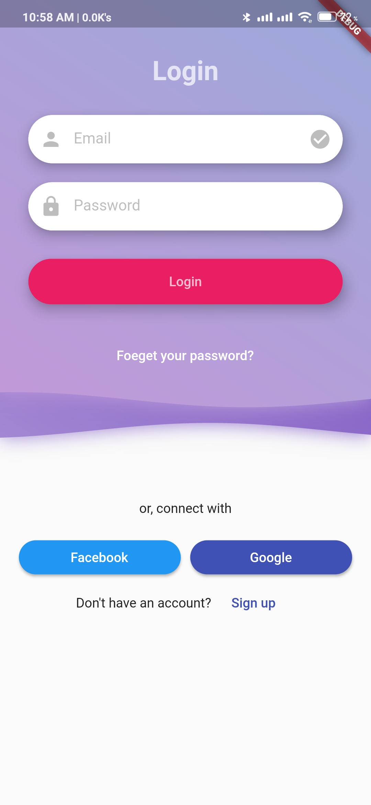
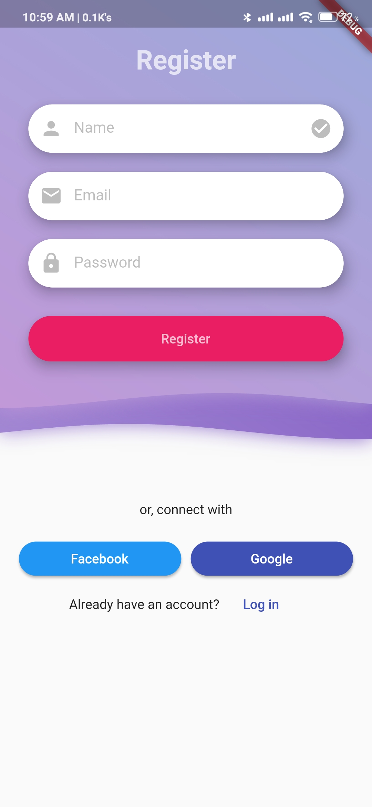
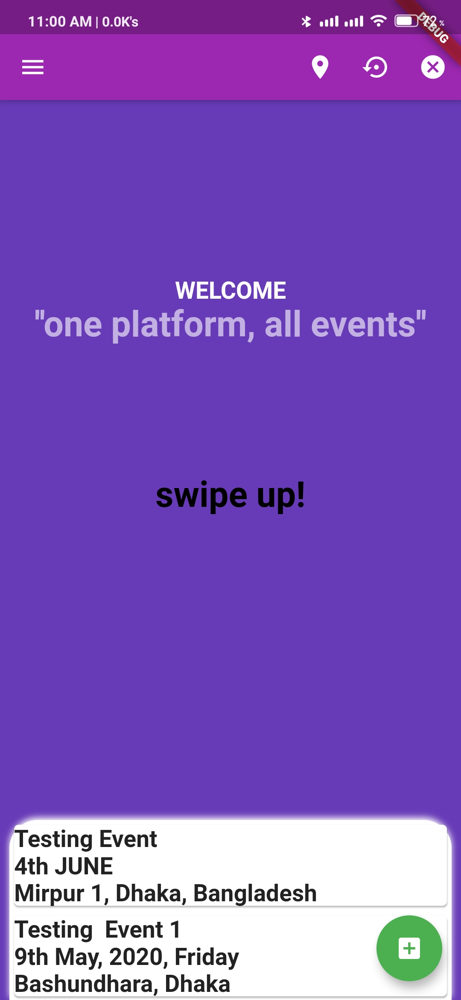
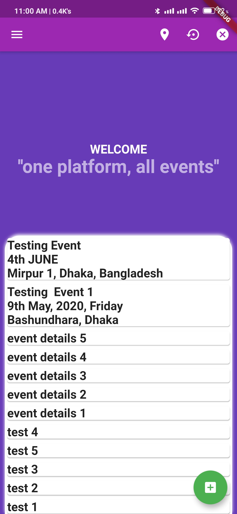
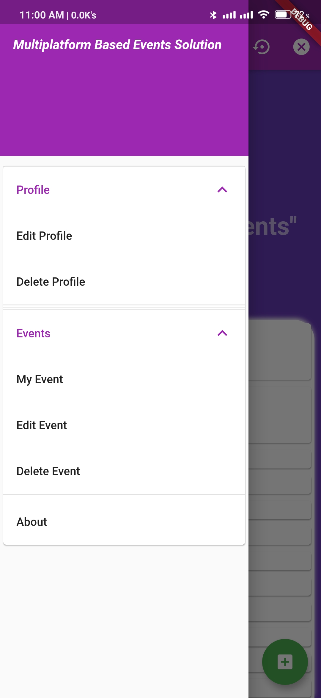
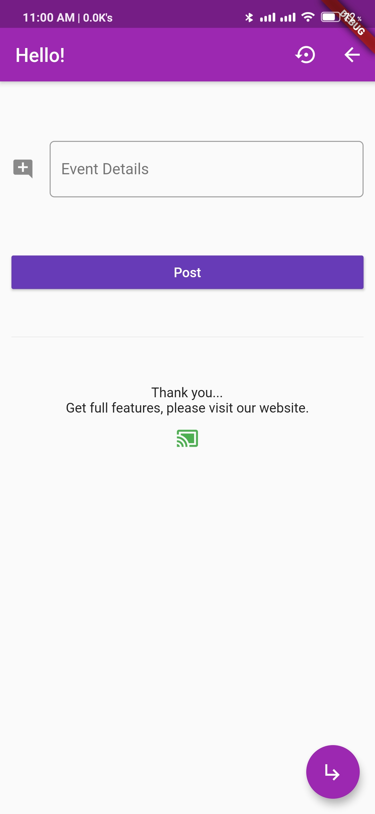

# Multiplatform-Based-Event-Solution-with-Flutter

## Abstract
People make events into stories, stories give events meaning. There are many events happening around us but there are not so many specific dedicated platforms to share their details (especially for our country). On the other hand if we think just about our university, there are 23 clubs in North South University and many students chapter as well. Also we have Career Placement Centre (CPC) and the Office of External Affairs (OEA) and all of them have several events, workshops, seminars, competitions and many more. The prime focus of the project is to make a platform where the users can create an event, update it, delete it and also there will be ticket buying system if the user needs it. Again, people can search their nearby events with their location. So, we built a website and also a mobile application for the easy use of this platform.  This repository only contains the mobile application part with flutter.

## Introduction
An event can be described as a public assembly for the purpose of celebration, education, marketing or reunion. Events can be classified on the basis of their size, type and context. There are so many events happening everyday and everywhere. If there will be a dedicated platform to remind you about your nearby events that would be awesome.
For making this, we are using Ruby & Ruby on Rails for the website’s backend part of the project as the programming language & framework. HTML, CSS, Bootstrap and a bit of Javascript for the front end part of our website part. Heroku for hosting the Web App, PostgreSQL for the database and Gravatar for the image uploading.
On the other hand, we are using Flutter for our mobile application which is quite new. Flutter is an open-source UI software development kit created by Google. It is used to develop applications for Android, iOS, Windows, Mac, Linux, Google Fuchsia and the web. Flutter apps are written in the Dart language and make use of many of the language's more advanced features. 

## Methodology
Mobile application and website should have connection to each other. That is why, after making REST API, I started working with the app. Firstly, I made the UI and UX design. After that I started writing code with flutter. After designing the layout of the app, I made connection between the app and the website through API. The app runs smoothly. But not having Mac OS, the iOS app development was not fiished.

### Website: https://obscure-hollows-36531.herokuapp.com
